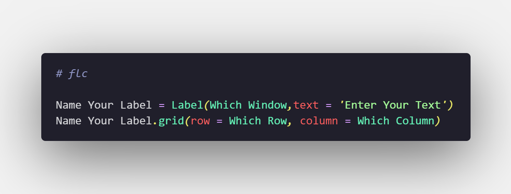
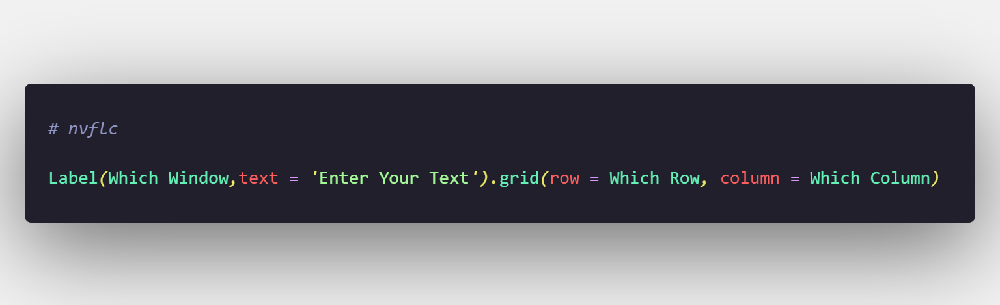
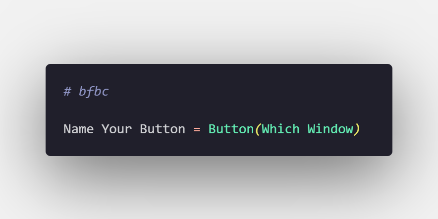
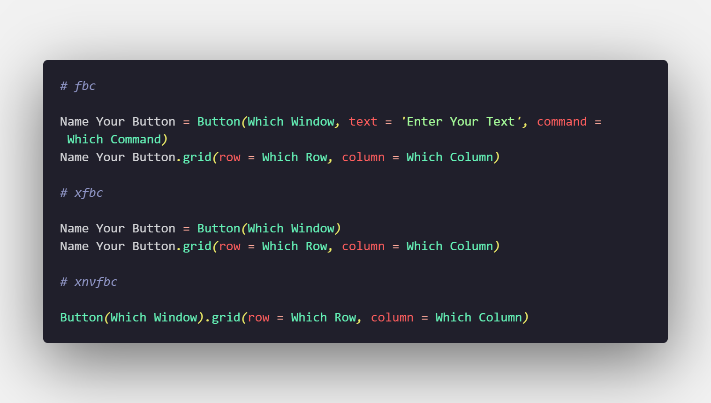
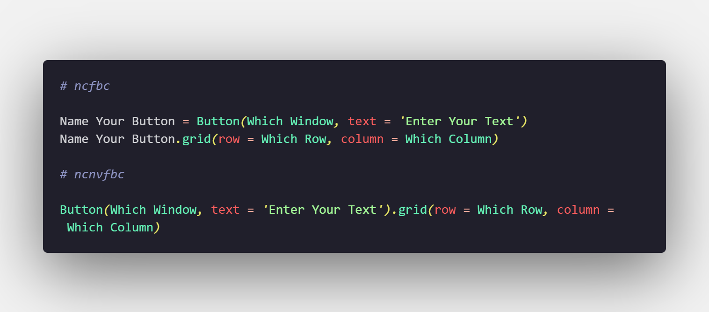

# Features

For list of snippets look at the bottom of the page. Also please read the "Note on snippet variety" for more details on how to use the snippets if you use different methods of importing tkinter.

# Usage

To use these snippets simply type a snippet into your editor and press tab. There will be fields you have to fill out, such as position, text etc. To fill this info out simply start typing. Once you fill in a field press tab to move on to the next field.

# Donations

If you like the extension, you can help me with my college expenses.

# Snippet types

## Regular snippets

Regular snippets create elements with their most used parameters.

### Example:

## No variable snippets

prefix: **nv** 

Putting nv before the regular snippet creates an element without assigning it to a variable. These are not always recommended, however they are useful sometimes.

### Example:

## Basic snippets

prefix: **b**

Putting b before the regular snippet creates an element with only the prompt for a variable name and window selection.

### Example:

## X snippets

prefix: **x**

Putting x before the regular snippet or the nv snippet creates an element with only the prompt for setting the window and the grid positioning. X snippets are not available for all elements.

### Example:

## No command snippets

prefix: **nc**

Putting nc befoe a regular or a nv snippet creates an element without a command parameter. This prefix can only be used for some elements (example: buttons).

### Example:

# List of snippets

## Note on snippet variety

As of update 2.0.0, all snippets have another form where you add the at- prefix. This pefix assumes you have used "import tkinter as tk" rather than "from tkinter import *" and adds tk. before every call to the tkinter module.

---

## Regular snippets

**ftc** - creates a new tkinter window

**flc** - creates a new label

**fec** - creates a new entry

**fbc** - creates a new button

**fcbc** - creates a new checkbutton

**frbc** - creates a new radiobutton

**ffc** - creates a new frame

**fomc** - creates a new optionmenu

**ftlc** - creates a new toplevel

## nv snippets *(no variable)*

**nvflc** - creates a new label without using a variable

**nvfec** - creates a new entry without using a variable

**nvfbc** - creates a new button without using a variable

**nvfcbc** - creates a new checkbutton without a variable (variable atribute is still in the definition of the checkbutton)

**nvfrbc** - creates a new radiobutton without a variable (variable atribute is still in the definition of the radiobutton)

**nvfomc** - creates a new optionmenu without a variable (variable atribute is still in the definition of the optionmenu)

## b snippets *(basic)*

**bftc** - creates a new basic tkinter window

**bflc** - creates a new basic label

**bfec** - creates a new basic entry

**bfbc** - creates a new basic button

**bfcbc** - creates a new basic checkbutton

**bfrbc** - creates a new basic radiobutton

**bffc** - creates a new basic frame

**bfomc** - creates a new basic optionmenu

**bftlc** - creates a new basic toplevel

## x snippets

**xflc** - creates a new x label

**xfbc** - creates a new x button

**xnvflc** - creates a new no variable x label

**xnvfbc** - creates a new no variable x button

**xfcbc** - creates a new x checkbutton

**xnvfcbc** - creates a new no variable x checkbutton

**xfrbc** - creates a new x radiobutton

**xnvfrbc** - creates a new no variable x radiobutton

**xffc** - creates a new x frame

**xfomc** - creates a new x optionmenu

**xnvfomc** - creates a new no variable x optionmenu

## nc snippets

**ncfbc** - creates a button without a command attribute

**ncnvfbc** - creates a button without a command attribute and without a variable

## Other snippets

**tki** - from tkinter import *

**mbi** - imports the messagebox module from tkinter

# Note

I am planning on doing another big update for the extension, however, the date is uncertain for now. I hope I can release it soon enough.

Thank you once again for using this extension!